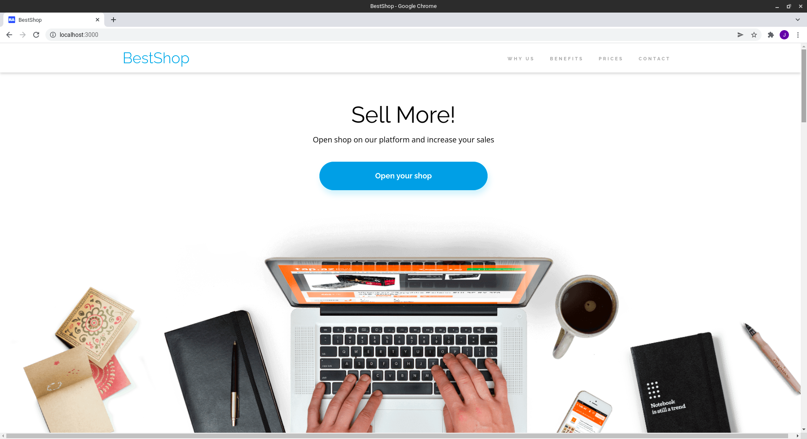
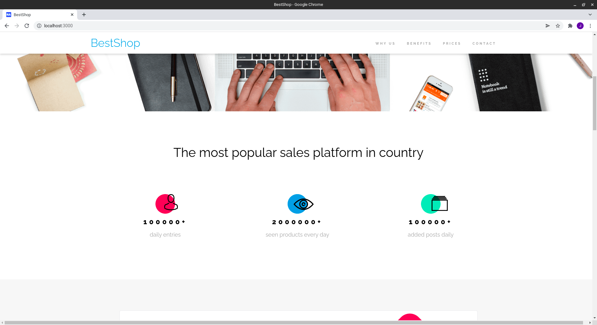
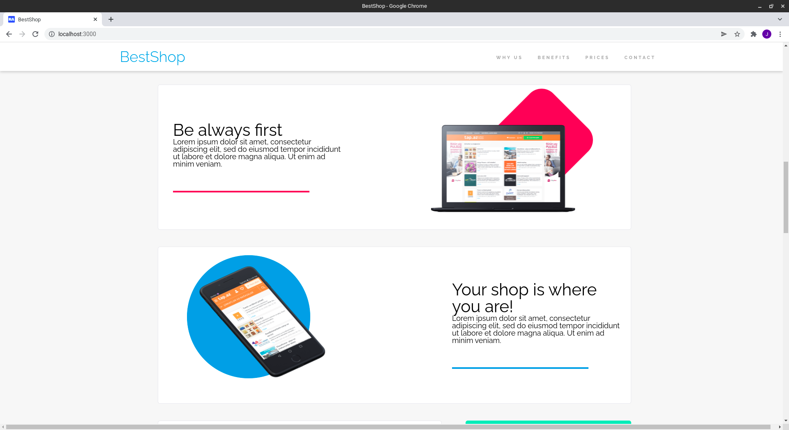
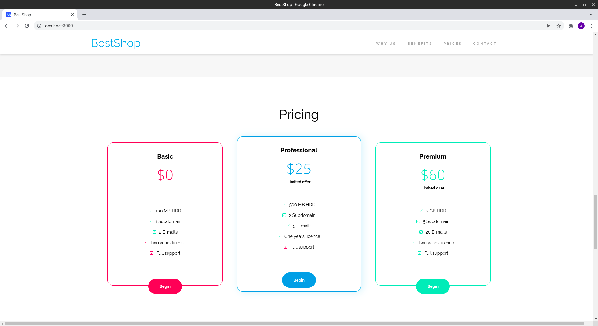
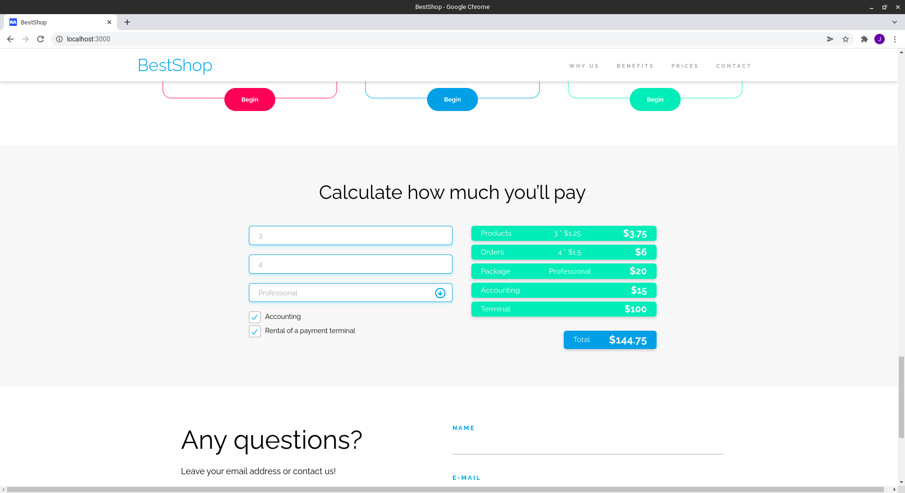
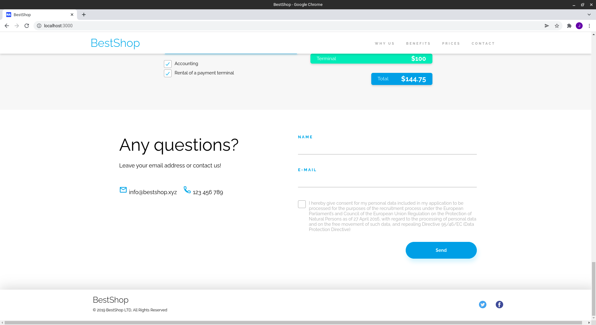
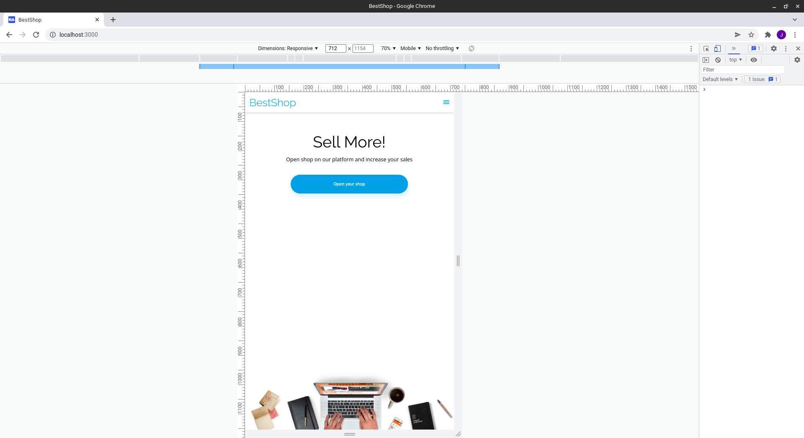
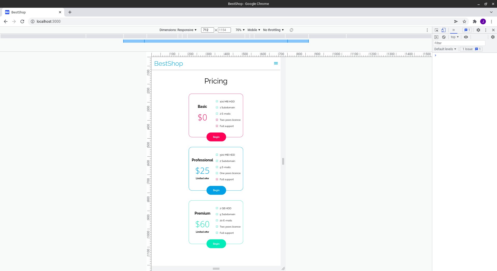
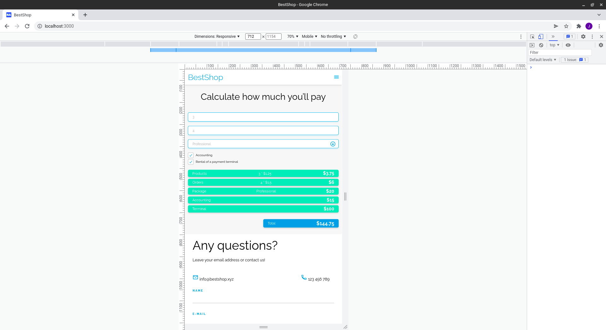

# BestShop
> Responsive web design, created in learning process at CodersLab bootcamp, evolving from plain HTML/SCC through SCSS to JS.

> Live demo [_here_](https://jacpolanski.github.io/BestShop/)

## Table of Contents
* [General Info](#general-information)
* [Technologies Used](#technologies-used)
* [Screenshots](#screenshots)
* [Setup](#setup)
* [Project Status](#project-status)
* [Room for Improvement](#room-for-improvement)
* [Contact](#contact)

## General Information
- Project created in learning process at CodersLab bootcamp
- Evolving in weekly periods as progress of learning topics
- Started as plain HTML/CSS
- Rewritten to SCSS and added responsiveness
- Added JavaScript pricing calculator

## Technologies Used
- HTML
- SCSS
- JavaScript

## Screenshots

## Setup
- download or clone repository / `git clone repo_address`
- install dependencies / `npm install`
- start by `gulp`

## Project Status
Project is: _no longer being worked on_. Assumed learning task completed.

## Room for Improvement
Plenty :)

## Contact
Created by [_jac.polanski_](https://www.linkedin.com/in/polanski-jacek/) - feel free to contact me!
